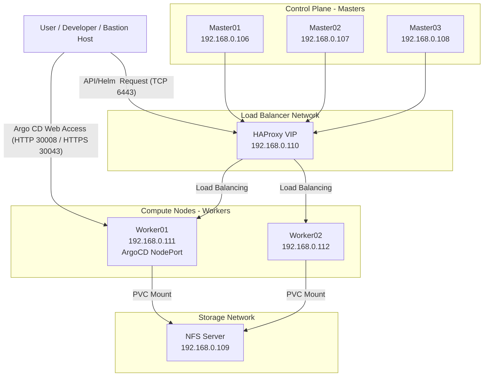

## Kubernetes Lab Project (K8s Automation & CI/CD)

이 프로젝트는 Ansible을 사용하여 **Kubernetes 클러스터(v1.32.0)** 를 자동으로 구축하고, Helm을 통해 필수 애드온을 설치하며, Argo Workflows와 Argo CD를 이용한 CI/CD 파이프라인을 실습하기 위한 Lab 환경입니다.

### 📋 주요 특징

*   **IaC (Infrastructure as Code)**: Ansible Playbook을 통한 전체 인프라 프로비저닝 자동화
*   **HA Architecture**: HAProxy 기반의 로드 밸런서(LB)와 다중 마스터 노드 지원 구조
*   **Storage**: NFS 서버 자동 구성 및 K8s StorageClass 연동
*   **Add-ons**: Ingress Controller, Cert Manager, DB 등 필수 요소 Helm 배포 관리
*   **CI/CD**: Argo Workflows(CI) 및 Argo CD(GitOps) 기반 파이프라인 구성

### 🛠 아키텍처 및 구성 요소

#### 0. 서버 구성도 (Architecture Diagram)


#### 1. 인프라 구성 (Ansible Roles)
`site.yaml` 플레이북을 통해 다음 노드들을 구성합니다.

| Role | 설명 |
|------|------|
| **common** | 모든 노드의 공통 OS 설정 (Timezone, 패키지 업데이트 등) |
| **container_runtime** | CRI-O 컨테이너 런타임 설치 (Master/Worker) |
| **lb** | HAProxy를 이용한 Kubernetes API Server 로드밸런싱 (`192.168.0.110`) |
| **master** | `kubeadm init`을 통한 Control Plane 구성 |
| **worker** | `kubeadm join`을 통한 워커 노드 조인 |
| **cni** | CNI(Container Network Interface) 플러그인 설치 (예: Calico) |
| **nfs_server** | NFS 공유 스토리지 서버 구성 |

#### 2. 서버 IP 구성 (Hosts)
`inventories/production/hosts.ini`에 정의된 서버 구성은 다음과 같습니다.

| Hostname | Role | IP Address | 설명 |
|----------|------|------------|------|
| **k8s-master01** | Master | 192.168.0.106 | Control Plane 노드 1 |
| **k8s-master02** | Master | 192.168.0.107 | Control Plane 노드 2 |
| **k8s-master03** | Master | 192.168.0.108 | Control Plane 노드 3 |
| **nfs** | NFS Server | 192.168.0.109 | 공유 스토리지 서버 |
| **lb-proxy** | Load Balancer | 192.168.0.110 | API Server VIP 로드밸런서 |
| **k8s-worker01** | Worker | 192.168.0.111 | 워크로드 실행 노드 1 |
| **k8s-worker02** | Worker | 192.168.0.112 | 워크로드 실행 노드 2 |

#### 3. 서비스 접속 정보
Argo CD 및 주요 서비스의 접속 포트 정보입니다.

| 서비스 | 타입 | Port (Protocol) | 접속 URL 예시 |
|--------|------|-----------------|---------------|
| **Argo CD** | NodePort | 30043 (HTTPS) | `https://192.168.0.111:30043` |
| **Argo CD** | NodePort | 30008 (HTTP) | `http://192.168.0.111:30008` |

> *   Argo CD 배포 설정은 `helm/argocd-values.yaml`에서 NodePort로 설정되어 있습니다.
> *   초기 접속 계정: `admin` (비밀번호는 클러스터 내 Secret에서 확인 필요)

#### 4. 쿠버네티스 애드온 (Helm)
`/helm` 디렉토리 내의 설정을 통해 배포됩니다.

*   **Ingress Nginx**: Ingress Controller
*   **Argo CD**: GitOps 배포 도구
*   **Argo Workflows**: 워크플로우 엔진 (CI)
*   **Cert Manager**: TLS 인증서 관리
*   **MariaDB**: 데이터베이스
*   **NFS Subdir External Provisioner**: 동적 PVC 프로비저닝

#### 3. CI/CD 파이프라인
*   **Argo Workflows**: `ci-kaniko-workflowtemplate.yaml` 등을 사용하여 Docker 이미지 빌드 및 레지스트리 푸시
*   **Argo CD**: 변경 사항을 감지하여 클러스터에 배포 (`argo-rbac.yaml`, `argo-workflow-ci-ver2.yaml` 등)

### 🚀 설치 및 사용 방법

#### 사전 요구 사항 & SSH 설정

**1. SSH 키 생성 및 배포 (필수)**
Ansible이 대상 서버에 패스워드 없이 접속하려면 SSH 키 배포가 필요합니다.

1) **SSH 키 생성** (Control Node에서 실행)
   ```bash
   # 기본값 엔터로 생성
   ssh-keygen -t ed25519 -f ~/.ssh/id_ed25519
   ```

2) **각 노드에 공개키 배포**
   생성된 공개키를 모든 관리 대상 서버(Master, Worker, LB, NFS)에 복사합니다.
   ```bash
   # Master Nodes
   ssh-copy-id -i ~/.ssh/id_ed25519.pub root@192.168.0.106
   ssh-copy-id -i ~/.ssh/id_ed25519.pub root@192.168.0.107
   ssh-copy-id -i ~/.ssh/id_ed25519.pub root@192.168.0.108

   # Worker Nodes
   ssh-copy-id -i ~/.ssh/id_ed25519.pub root@192.168.0.111
   ssh-copy-id -i ~/.ssh/id_ed25519.pub root@192.168.0.112

   # Infra Nodes (NFS, LB)
   ssh-copy-id -i ~/.ssh/id_ed25519.pub root@192.168.0.109
   ssh-copy-id -i ~/.ssh/id_ed25519.pub root@192.168.0.110
   ```

**2. Ansible 포트 및 키 설정 (`hosts.ini`)**
배포한 키 경로를 `inventories/production/hosts.ini` 파일에 명시해야 Ansible이 인식합니다.

```ini
[all:vars]
ansible_user=root
# 위에서 생성한 개인키 경로 지정
ansible_ssh_private_key_file=~/.ssh/id_ed25519
ansible_python_interpreter=/usr/bin/python3
```

**3. 실행 환경 구성 (Control Node)**
이 프로젝트를 실행하기 위해 제어 노드(내 컴퓨터 또는 Bastion 서버)에 다음 도구들이 설치되어 있어야 합니다.

*   **Python 3.9 이상**: Ansible 실행을 위한 필수 런타임
*   **Ansible Core**: 인프라 자동화 도구
    ```bash
    # pip로 설치 예시
    pip install ansible
    ```
*   **VS Code Extensions (권장)**: 코드 편집 및 문법 강조를 위해 다음 확장 프로그램 설치를 권장합니다.
    *   [Ansible](https://marketplace.visualstudio.com/items?itemName=redhat.ansible) (Red Hat)
    *   [Kubernetes](https://marketplace.visualstudio.com/items?itemName=ms-kubernetes-tools.vscode-kubernetes-tools) (Microsoft)
    *   [Remote Development](https://marketplace.visualstudio.com/items?itemName=ms-vscode-remote.vscode-remote-extensionpack) (원격 접속 시)

*   `inventories/production/hosts.ini` 파일에 대상 호스트 IP가 맞는지 확인

#### 클러스터 구축 실행 (전체 또는 단계별)

**옵션 1: 전체 클러스터 한번에 구축**
```bash
## OS 설정 -> 런타임 -> LB -> Master -> Worker -> CNI -> NFS
ansible-playbook site.yaml
```

**옵션 2: 태그를 이용한 단계별 구축 (권장)**
디버깅이나 단계별 확인이 필요한 경우, 아래 순서대로 태그(`--tags`)를 지정하여 실행합니다.

```bash
# 1. 공통 OS 설정 (Swap 비활성화, 필수 패키지 설치 등)
ansible-playbook site.yaml --tags common

# 2. 컨테이너 런타임 설치 (CRI-O)
ansible-playbook site.yaml --tags runtime

# 3. 로드밸런서(HAProxy) 구성
ansible-playbook site.yaml --tags lb

# 4. 마스터 노드(Control Plane) 구성 (Init, Join)
ansible-playbook site.yaml --tags master

# 5. 워커 노드 구성 (Join)
ansible-playbook site.yaml --tags worker

# 6. CNI 네트워크 플러그인 설치 (Calico)
ansible-playbook site.yaml --tags cni

# 7. NFS 스토리지 서버 구성
ansible-playbook site.yaml --tags nfs
```

#### 클러스터 초기화 (Reset)
구축된 클러스터를 초기화하려면 `k8s_reset` 태그 또는 역할을 사용할 수 있습니다.

```bash
## 예시: reset 역할 실행 (site.yaml에 포함되어 있거나 별도 실행 필요)
ansible-playbook site.yaml --tags k8s_reset
```

### 📂 프로젝트 구조

```text
.
├── ansible.cfg              # Ansible 설정
├── site.yaml                # 메인 플레이북 Ansible
├── inventories/             # 호스트 인벤토리 Ansible
├── group_vars/              # 전역 변수 (K8s 버전, CIDR 등)
├── roles/                   # Ansible Role 정의 Ansible
│   ├── common               # 공통 설정
│   ├── container_runtime    # CRI-O 등 런타임
│   ├── master               # K8s Master
│   ├── worker               # K8s Worker
│   ├── lb                   # HAProxy LB
│   ├── nfs_server           # NFS 서버
│   └── cni                  # 네트워크 플러그인
├── helm/                    # Helm 차트 값(Values) 파일 및 설치 스크립트
├── k8s/                     # 추가 Kubernetes 매니페스트
├── dockerfiles/             # 테스트용 Dockerfile 모음
└── argo-*.yaml              # ArgoCD/Workflows 관련 매니페스트
```

#### 📌 주요 디렉토리 및 파일 상세 설명

*   **`ansible.cfg`**: Ansible 실행 시 참조하는 설정 파일입니다. 인벤토리 파일 위치, SSH 접속 설정, 권한 상승(sudo) 관련 설정을 정의합니다.
*   **`site.yaml`**: 전체 인프라 구축 프로세스를 정의하는 메인 Playbook입니다. 각 Role을 순서대로 호출하여 클러스터를 완성합니다.
*   **`inventories/`**: 관리 대상 서버들의 접속 정보(IP, User, Key)와 그룹(Master, Worker, LB, NFS)을 정의하는 호스트 파일(`hosts.ini`)이 위치합니다.
*   **`group_vars/`**: 모든 호스트 또는 특정 그룹에 적용될 공통 변수(`k8s_version`, `pod_network_cidr` 등)를 관리합니다.
*   **`roles/`**: Ansible의 실행 단위를 기능별로 분리한 모듈 디렉토리입니다.
    *   **`common`**: 모든 서버에 공통적으로 적용되는 OS 설정 (Swap off, Firewalld stop, SELinux 등)
    *   **`container_runtime`**: 모든 K8s 노드에 컨테이너 런타임(CRI-O) 설치 및 설정
    *   **`lb`**: Control Plane의 고가용성(HA)을 위한 HAProxy 로드밸런서 구성
    *   **`master`**: `kubeadm init`을 통한 Control Plane 초기화 및 Join Token 생성
    *   **`worker`**: `kubeadm join`을 사용한 워커 노드 클러스터 연결
    *   **`cni`**: Pod 간 통신을 위한 네트워크 플러그인(Calico) 배포
    *   **`nfs_server`**: 공유 스토리지를 위한 NFS 서버 패키지 설치 및 설정
*   **`helm/`**: Kubernetes 필수 애드온(Ingress, Cert-Manager, ArgoCD 등) 설치를 위한 Helm Values 파일과 설치 가이드를 포함합니다.
*   **`k8s/`**: Helm 차트 외에 직접 적용해야 하는 추가 매니페스트(StorageClass, PVC 등)를 보관합니다.
*   **`dockerfiles/`**: CI/CD 파이프라인 테스트를 위한 다양한 언어/환경별(Java, Node, Nginx) Dockerfile 예제입니다.
*   **`argo-*.yaml`**: Argo Workflows(CI) 및 Argo CD(CD)에서 사용하는 파이프라인 정의 및 애플리케이션 배포 설정 파일입니다.

### 📝 환경 변수 설정
`group_vars/all.yaml` 파일에서 주요 설정을 변경할 수 있습니다.

*   `kubernetes_version`: 설치할 K8s 버전 (현재: `1.32.0`)
*   `k8s_api_vip`: API Server VIP 주소
*   `container_runtime`: 사용할 런타임 (crio)

### 🐳 Dockerfiles 안내
프로젝트에는 테스트/실습용 Dockerfile들이 포함되어 있습니다. 각 이미지의 목적과 특징은 다음과 같습니다.

| 파일 | 베이스 이미지 | 용도 | 특징 |
|------|---------------|------|------|
| `Dockerfile` | `ubuntu:22.04` | Ansible 컨트롤 노드/유틸 컨테이너 | `python3`, `pip`, `ansible>=9`, `sshpass`, `git`, `vim` 설치 |
| `dockerfiles/jdk-dockerfile` | `eclipse-temurin:17-jdk-jammy` | Java 빌드 환경 | Gradle 8.6, Maven 3.9.9 설치, 기본 빌드 도구 포함 |
| `dockerfiles/jre-dockerfile` | `eclipse-temurin:17-jre-jammy` | Java 런타임 | `JAVA_OPTS` 기본값, `EXPOSE 8080` |
| `dockerfiles/nginx-dockerfile` | `nginx:1.25-alpine` | 정적 웹/SPA 서빙 | `dockerfiles/nginx.conf` 사용, 80 포트 노출 |
| `dockerfiles/node-dockerfile` | `node:20-alpine` | Node.js 개발/빌드 | `git`, `bash`, `curl`, `openssh-client` 포함 |

#### 빌드 예시
```bash
# Ansible/유틸 컨테이너
docker build -t k8s-lab-ansible -f Dockerfile .

# Java JDK 빌드 이미지
docker build -t k8s-lab-jdk -f dockerfiles/jdk-dockerfile .

# Java JRE 런타임 이미지
docker build -t k8s-lab-jre -f dockerfiles/jre-dockerfile .

# Nginx 정적 웹 이미지 (nginx.conf 포함)
docker build -t k8s-lab-nginx -f dockerfiles/nginx-dockerfile dockerfiles

# Node.js 개발 이미지
docker build -t k8s-lab-node -f dockerfiles/node-dockerfile .
```

### 🧩 Roles 상세
`site.yaml`에서 사용하는 주요 Role의 실제 동작 요약입니다. (roles/<role>/tasks/main.yaml 기준)

| Role | 주요 작업 |
|------|-----------|
| `common` | swap 비활성화, firewalld 중지, SELinux permissive 전환, 기본 유틸 패키지 설치 |
| `container_runtime` | CRI-O 커널 모듈/`sysctl` 설정, CRI-O Repo/패키지 설치, cgroup 설정, 서비스 활성화 |
| `master` | Kubernetes repo/패키지 설치, `kubeadm init`(master01), kubeconfig 생성, control-plane join 명령 생성 및 master02/03 join |
| `worker` | Kubernetes repo/패키지 설치, master01에서 join 명령 생성, 워커 join 수행 |
| `cni` | Calico 매니페스트 다운로드/수정(pod CIDR), 클러스터에 적용 (master01 only) |
| `lb` | HAProxy 설치 및 설정 배포, 서비스 활성화 |
| `nfs_server` | NFS 패키지 설치, export 디렉터리/`/etc/exports` 설정, 서비스 활성화 |
| `k8s_reset` | `kubeadm reset`, K8s/CNI 디렉터리 정리, CNI 인터페이스 및 iptables 정리, kubelet 재시작 |

## 🤝 Contribution Guide

협업 및 브랜치 전략은 아래 문서를 참고하세요.

👉 [Contribution Guide](CONTRIBUTING.md)
